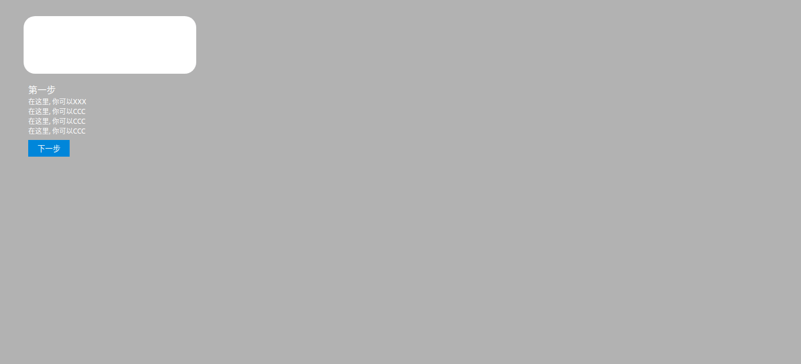

## 一个简单的教学步骤插件 `base React`

### useage
```jsx
import Guide from 'simple-guide'


const StepContainer = props => (<div>
        <Guide config={{
                describtions: [ // 每一步的配置
                    {
                        top: '100px', // 顶部距离
                        left: '200px', // 左边距离
                        highLight: {
                            height: '100px', // 高亮的高度
                            width: '300px' // 高亮的宽度
                        },
                        title: '第一步', // 下部标题
                        subDescs: [
                            '在这里, 你可以XXX', // 描述
                            '在这里, 你可以CCC',
                            '在这里, 你可以CCC',
                            '在这里, 你可以CCC',
                        ]
                    },
                    // 第二步
                    {
                        top: '200px',
                        left: '400px',
                        highLight: {
                            height: '100px',
                            width: '100px'
                        },
                        title: '第二步',
                        subDescs: [
                            '在这里, 你可以ZZZ',
                            '在这里, 你可以AAA',
                        ]
                    },
                    {
                        top: '300px',
                        left: '500px',
                        highLight: {
                            height: '100px',
                            width: '400px'
                        },
                        title: '恭喜你完成全部教程'
                    }
                ]
            }} />
    </div>)
```

### 使用效果

